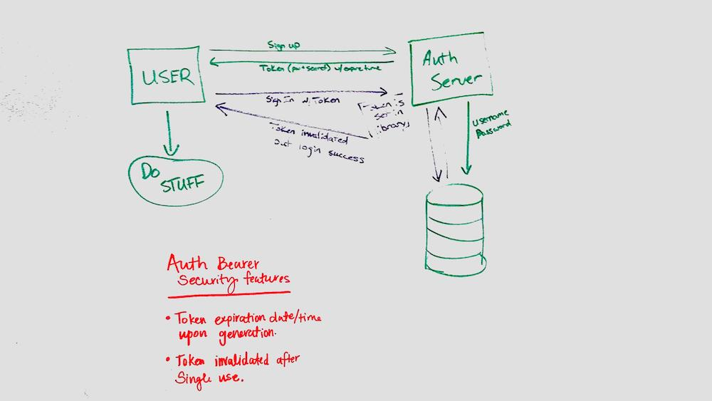

 LAB
=================================================

## Authorization

### Author: Becca Lee
Worked with Heather Cherewaty, Brent Woodward, Jacob Anderson, Caity Heath, and Siobhan Niess

### Links and Resources

* [repo](https://github.com/beccalee123/18-authorization/pull/1)
* [travis](https://www.travis-ci.com/beccalee123/18-authorization)
* [heroku](https://bl-auth-lab.herokuapp.com/) 

#### Documentation
* [jsdoc](http://xyz.com) (All assignments)

### Modules
- `index.js` starts the mongo server and the web server
- `src/app.js` sets up the app.use functionality
- `src/auth/middleware.js` contains the middleware auth functions
- `src/auth/router.js` contains the routes
- `src/auth/users-model.js` contains the users constructor and methods
- `src/auth/oauth/google.js` contains good OAuth functionality (when needed. File not currently in use)
- `src/middleware/404.js` contains 404 error
- `src/middleware/500.js` contains the 500 error

### Setup
#### `.env` requirements
* `PORT` - 8080
* `MONGODB_URI` - mongodb://localhost:27017/store
* `SECRET` (your chosen secret)
* `TOKEN_LIFETIME` (your chosen token lifetime)

#### Running the app
* `npm start`

  
#### Tests
* How do you run tests?
Tests are run with jest and travis
* What assertions were made?
* What assertions need to be / should be made?

#### UML
